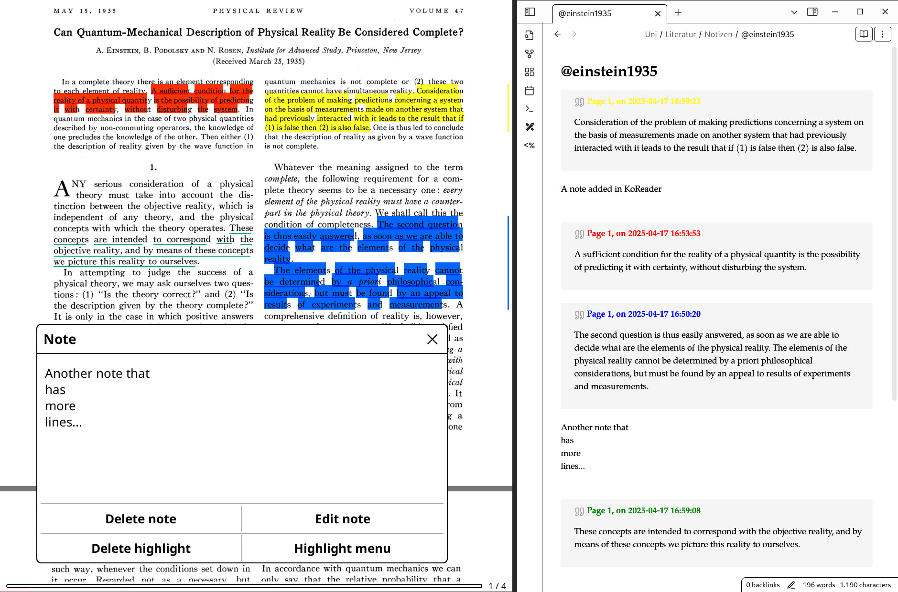

# Import KoReader Notes into Obsidian

This repository [holds a Templater template](https://raw.githubusercontent.com/schuhumi/Obsidian-Templater-Add-KoReader-Notes/refs/heads/main/Add%20KoReader%20Notes.md), that can extract notes taken in KoReader and put them into your markdown document.

> *Terms:* [KoReader](https://github.com/koreader/koreader) is a PDF and ebook reader tailored towards epaper devices, and also supports highlighting parts and/or adding notes. [Obsidian](https://obsidian.md/) is a  knowledge base using markdown formatted files. [Templater](https://github.com/SilentVoid13/Templater) is an templating plugin for Obsidian, that allows to execute JavaScript as part of processing a template.

### Prerequisites

The implementation of this template hinges on the idea of an organized library of documents, as often encountered for processing academic papers:

- Every document is identified by a unique name or key. For papers a scheme with the first author's surname and the publication year is popular (like `einstein1935` for example)

- All the KoReader sidecar folders reside in a known location. Typically, one would have a folder with all the documents, including a `einstein1935.pdf` for example. When reading this PDF with KoReader and making annotations, its default setting is to save them in a `einstein1935.sdr` folder just besides the document.

- When working on the corresponding markdown note in obsidian, it also gives away which document it belongs to. For example an convention could be to give it the corresponding unique name with a `@`-prefix, like `@einstein1935.md`.

### How to use

Like any other Templater template. You need to adjust the `note2sidecar()` function as explained at the top of the template, so that it can infer where to find the KoReader sidecar files.

If you use the [Citations plugin](https://github.com/hans/obsidian-citation-plugin) in Obsidian, you can also insert the KoReader notes automatically when creating a note for a literature document. To do so, in the Citations plugin settings add `<% tp.file.include("[[Add KoReader Notes]]") %>` to your literature note content template. In the Templater plugin settings, you can activate "Trigger Templater on new file creation", to not having to invoke Templater manually after creating the note.

### Pitfalls

- KoReader saves the book metadata on closing the document or every 15 minutes by default. So close the document if the corresponding `.sdr` directory wasn't saved yet. You can change the saving interval in KoReader in the top menu in the gear tab.

- If the template does not work as expected, you can use the developer console in Obsidian to see some output. The default shortcut to open the inspector is `ctrl+shift+i`, then switch to the "Console" tab.
